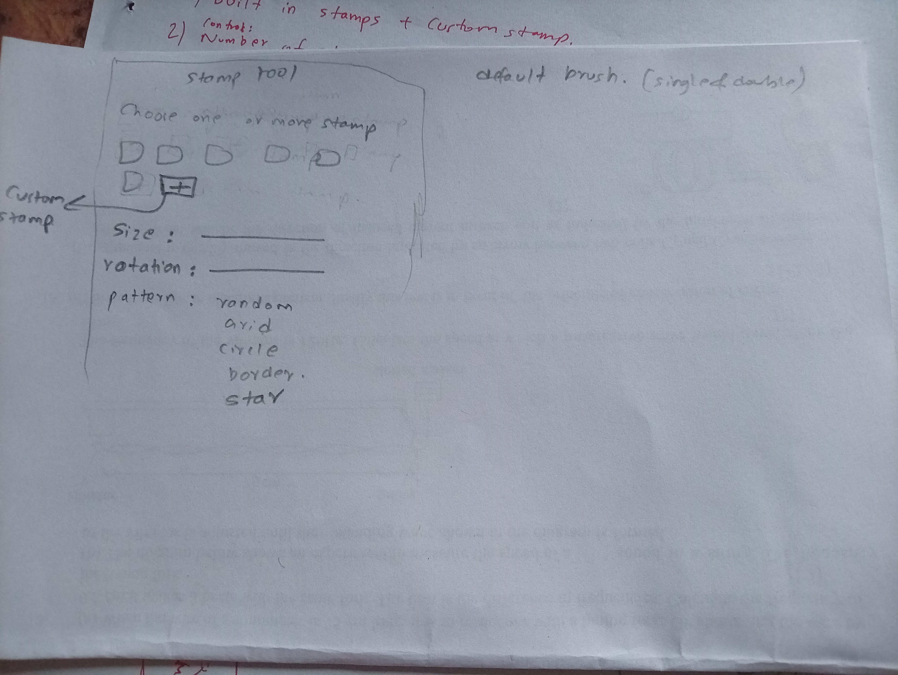

rough idea sketch

08/31 added custom stamp button
while trying to add custom stamp button at the beginning, even though i specified to only accept png,jpg,jpeg.. while running, it literally even accepted sb3 and folders lol.

09/01 plotted out UI first(i already liked where it was going), then added stamps as builtin. now making it functional would probably take time.

next, i added code to detect mouse events so that stamping on canvas works, but after multiple testing, testing clicks, testing with popups, there is still problem of stamps not being painted in canvas. I'm gonna solve that tomorrow and hopefully add functions to size, rotaion and patterns too.

09/02 after debugging, stamps appear on canvas yay!! but now gotta center it around cursor.

09/03->09/05 the stamp is finally centered around cursor after adjusting x,y coordinates. 

even though i used PNGs and transparent background, the stamps on canvas shows white background [i'll keep that for later]

also to make stamp tool as the active layer and no other brushes could overwrite it[coz while testing the select and brush tool were also being used simultaneously with stamp tool] i used activeNode() and setPixelData(). 

also, used current_stamp_index and next_stamp() to make the sequence of multiple selected stamps.

used MouseButtonPress,MouseMove and MouseButtonReleased to make stamping smooth and dragable. 

then added spacing between each stamp so it appears neat and doesn't get generated for every single mouse event.

separated files for Ui, plugin entry point and actual stamping function.[coz the lines of codes in stamp_generater was 400+ ]

size & rotation was easy, just passing value to canvas_stamper.py since UI was already made.

there are still some problems now , the eraser tool or any other tool doesn't work on canvas after stamping. also i think i need to show value of chosen size and rotation in slider to users.